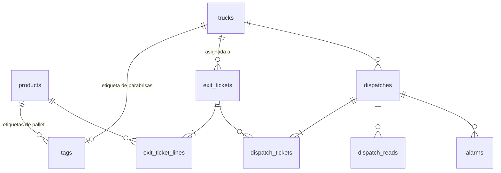

# Modelo de datos (PostgreSQL) — borrador v0.1

Se guardará como `windows_app/schema.sql` y la app lo ejecuta al arrancar (`CREATE ... IF NOT EXISTS`). Nombres de tablas y columnas en inglés; la interfaz va en español.



## Catálogos

```sql
CREATE TABLE IF NOT EXISTS products (
    id           BIGINT GENERATED ALWAYS AS IDENTITY PRIMARY KEY,
    code         TEXT NOT NULL UNIQUE,
    name         TEXT NOT NULL,
    presentation TEXT,
    active       BOOLEAN NOT NULL DEFAULT true
);

CREATE TABLE IF NOT EXISTS trucks (
    id                BIGINT GENERATED ALWAYS AS IDENTITY PRIMARY KEY,
    unit_number       TEXT NOT NULL UNIQUE,          -- número económico
    plate             TEXT,
    driver            TEXT,
    status            TEXT NOT NULL DEFAULT 'available'
                      CHECK (status IN ('available', 'en_route')),
    status_changed_at TIMESTAMPTZ NOT NULL DEFAULT now()
);
```

## Etiquetas

```sql
-- consecutivo para el folio de los pallets
CREATE SEQUENCE IF NOT EXISTS pallet_folio_seq;

CREATE TABLE IF NOT EXISTS tags (
    epc          VARCHAR(48) PRIMARY KEY,            -- EPC del chip (24 hex), en mayúsculas
    kind         TEXT NOT NULL CHECK (kind IN ('pallet', 'truck')),
    folio        TEXT UNIQUE,                        -- folio del pallet (PLT-000123), generado al capturar
    product_id   BIGINT REFERENCES products(id),     -- solo pallets
    truck_id     BIGINT REFERENCES trucks(id),       -- solo camiones
    status       TEXT NOT NULL DEFAULT 'captured'
                 CHECK (status IN ('captured', 'dispatched')),  -- 'dispatched' aplica a pallets
    captured_at  TIMESTAMPTZ NOT NULL DEFAULT now(), -- para pallets = FECHA DE SALIDA DE PRODUCCIÓN (primera captura)
    last_read_at TIMESTAMPTZ,
    CHECK (
        (kind = 'pallet' AND product_id IS NOT NULL AND truck_id IS NULL AND folio IS NOT NULL) OR
        (kind = 'truck'  AND truck_id  IS NOT NULL AND product_id IS NULL AND folio IS NULL)
    )
);

-- una sola etiqueta de parabrisas por camión
CREATE UNIQUE INDEX IF NOT EXISTS one_tag_per_truck
    ON tags (truck_id) WHERE kind = 'truck';
CREATE INDEX IF NOT EXISTS idx_tags_product_status ON tags (product_id, status);
```

### Alta de un pallet (captura)

El folio se genera en la propia sentencia de alta; `captured_at` toma la fecha y hora actuales y **no se modifica después** (ni al corregir el producto ni al leer la etiqueta). Una etiqueta ya capturada no se vuelve a insertar: la API responde `already_captured`.

```sql
INSERT INTO tags (epc, kind, folio, product_id)
VALUES (%s, 'pallet', 'PLT-' || lpad(nextval('pallet_folio_seq')::text, 6, '0'), %s)
ON CONFLICT (epc) DO NOTHING
RETURNING folio, captured_at;
```

> Si no devuelve fila, la etiqueta ya existía. Los huecos en el consecutivo (por conflictos o errores) son aceptables.
> Eliminar una etiqueta y recapturarla genera un folio y una fecha nuevos; por eso solo debe permitirse eliminar etiquetas en estado `captured`.

### Productos de la demo (`seed.py`)

```sql
INSERT INTO products (code, name, presentation) VALUES
    ('COCA-2L',     'Coca Cola 2 L',     '2 L'),
    ('COCA-600',    'Coca Cola 600 ml',  '600 ml'),
    ('SPRITE-600',  'Sprite 600 ml',     '600 ml'),
    ('CRISTAL-600', 'Agua Cristal 600 ml', '600 ml'),
    ('BEVI-355',    'Bevi 355 ml',       '355 ml')
ON CONFLICT (code) DO NOTHING;
```

## Boletas de salida

El folio (`BOL-000123`) se genera igual que el de los pallets: en la propia
sentencia de alta, con su propio consecutivo (`exit_ticket_folio_seq`). El
cliente no tiene catálogo propio: es un campo de texto libre en `customer`
(no hay tabla de clientes en esta demo).

```sql
-- consecutivo para el folio de las boletas de salida
CREATE SEQUENCE IF NOT EXISTS exit_ticket_folio_seq;

CREATE TABLE IF NOT EXISTS exit_tickets (
    id            BIGINT GENERATED ALWAYS AS IDENTITY PRIMARY KEY,
    folio         TEXT NOT NULL UNIQUE,              -- generado al crear (BOL-000123)
    customer      TEXT NOT NULL,                     -- texto libre, sin catálogo de clientes
    truck_id      BIGINT REFERENCES trucks(id),      -- asignado desde Windows
    status        TEXT NOT NULL DEFAULT 'active'
                  CHECK (status IN ('active', 'dispatched', 'cancelled')),
    created_at    TIMESTAMPTZ NOT NULL DEFAULT now(),
    dispatched_at TIMESTAMPTZ
);

CREATE TABLE IF NOT EXISTS exit_ticket_lines (
    ticket_id  BIGINT NOT NULL REFERENCES exit_tickets(id) ON DELETE CASCADE,
    product_id BIGINT NOT NULL REFERENCES products(id),
    pallets    INTEGER NOT NULL CHECK (pallets > 0),
    PRIMARY KEY (ticket_id, product_id)
);
```

## Salidas a ruta

`status` guarda **cómo salió** (si acaba cuadrando o se autorizó con diferencia) y
no cambia después. `delivered_at` guarda **si ya regresó a planta** ("Unidad en
planta", pantalla Windows) y es independiente: así no se pierde el "tipo de
salida" al entregarse. La pantalla de Windows combina ambos campos para mostrar
dos columnas separadas:

| Estado (en qué parte del proceso va) | Tipo de salida (cómo salió) |
| --- | --- |
| `status = in_progress` → "No ha salido" | — |
| `status` completed* y `delivered_at` nulo → "En ruta" | `completed` → "Normal"; `completed_with_difference` → "Con autorización" |
| `status` completed* y `delivered_at` no nulo → "Entregado" | igual que arriba |
| `status = cancelled` → "Cancelada" | — |

```sql
CREATE TABLE IF NOT EXISTS dispatches (
    id                   BIGINT GENERATED ALWAYS AS IDENTITY PRIMARY KEY,
    truck_id             BIGINT NOT NULL REFERENCES trucks(id),
    status               TEXT NOT NULL DEFAULT 'in_progress'
                         CHECK (status IN ('in_progress', 'completed',
                                           'completed_with_difference', 'cancelled')),
    started_at           TIMESTAMPTZ NOT NULL DEFAULT now(),
    finished_at          TIMESTAMPTZ,
    authorized_by        TEXT,                        -- solo si fue con diferencia
    authorization_reason TEXT,
    delivered_at         TIMESTAMPTZ                   -- "Unidad en planta"; no toca 'status'
);

-- un camión, una sola salida en proceso
CREATE UNIQUE INDEX IF NOT EXISTS one_open_dispatch_per_truck
    ON dispatches (truck_id) WHERE status = 'in_progress';

CREATE TABLE IF NOT EXISTS dispatch_tickets (
    dispatch_id BIGINT NOT NULL REFERENCES dispatches(id) ON DELETE CASCADE,
    ticket_id   BIGINT NOT NULL REFERENCES exit_tickets(id),
    PRIMARY KEY (dispatch_id, ticket_id)
);

CREATE TABLE IF NOT EXISTS dispatch_reads (
    dispatch_id  BIGINT NOT NULL REFERENCES dispatches(id) ON DELETE CASCADE,
    epc          VARCHAR(48) NOT NULL,                -- sin FK: puede ser una etiqueta no registrada
    result       TEXT NOT NULL
                 CHECK (result IN ('counted', 'unknown', 'already_dispatched', 'other_truck')),
    product_id   BIGINT REFERENCES products(id),      -- producto de la etiqueta (si es pallet registrado)
    first_read_at TIMESTAMPTZ NOT NULL DEFAULT now(),
    PRIMARY KEY (dispatch_id, epc)
);
```

## Alarmas y lecturas

```sql
CREATE TABLE IF NOT EXISTS alarms (
    id              BIGINT GENERATED ALWAYS AS IDENTITY PRIMARY KEY,
    dispatch_id     BIGINT REFERENCES dispatches(id),
    type            TEXT NOT NULL
                    CHECK (type IN ('missing', 'excess', 'unknown_tag', 'already_dispatched',
                                    'no_active_tickets', 'truck_not_available')),
    message         TEXT NOT NULL,
    details         JSONB NOT NULL DEFAULT '{}'::jsonb,   -- p. ej. producto y diferencia
    created_at      TIMESTAMPTZ NOT NULL DEFAULT now(),
    acknowledged_at TIMESTAMPTZ,
    acknowledged_by TEXT
);
CREATE INDEX IF NOT EXISTS idx_alarms_open ON alarms (created_at) WHERE acknowledged_at IS NULL;

CREATE TABLE IF NOT EXISTS reads (
    id      BIGINT GENERATED ALWAYS AS IDENTITY PRIMARY KEY,
    epc     VARCHAR(48) NOT NULL,
    read_at TIMESTAMPTZ NOT NULL DEFAULT now(),
    source  TEXT
);
CREATE INDEX IF NOT EXISTS idx_reads_epc_time ON reads (epc, read_at DESC);
```

## Lista blanca de prefijos de EPC

Pantalla "Prefijos" (Windows). Una etiqueta leída que no empiece con ninguno
de estos prefijos se ignora por completo (ni se captura, ni se cuenta, ni
genera alarma) — se asume ajena al proyecto. Decisión del usuario,
2026-10-07.

```sql
CREATE TABLE IF NOT EXISTS epc_prefixes (
    id         BIGINT GENERATED ALWAYS AS IDENTITY PRIMARY KEY,
    prefix     TEXT NOT NULL UNIQUE,
    created_at TIMESTAMPTZ NOT NULL DEFAULT now()
);
INSERT INTO epc_prefixes (prefix) VALUES ('E28011') ON CONFLICT (prefix) DO NOTHING;
```

## Cálculo de la verificación

```sql
-- esperado por producto, sumando las boletas elegidas en la salida
SELECT l.product_id, SUM(l.pallets) AS expected
FROM dispatch_tickets dt
JOIN exit_ticket_lines l ON l.ticket_id = dt.ticket_id
WHERE dt.dispatch_id = %s
GROUP BY l.product_id;

-- leído por producto (solo etiquetas contadas)
SELECT product_id, COUNT(*) AS read
FROM dispatch_reads
WHERE dispatch_id = %s AND result = 'counted'
GROUP BY product_id;
```

La salida es **correcta** si, para todos los productos, `leído = esperado`
(contando solo `result = 'counted'`). Una lectura `unknown` o
`already_dispatched` de más **ya no bloquea** este cálculo (decisión del
usuario, 2026-10-07) — solo falta o sobra producto de verdad sigue
generando alarmas que bloquean el cierre; las etiquetas `unknown`/
`already_dispatched` quedan igual registradas en `alarms` para revisión,
y si hubo una `already_dispatched` la respuesta de `POST .../finish`
también la reporta (`ya_despachadas`) para que la APK avise aunque cierre
correcta.

## Cierre de una salida correcta (una sola transacción)

1. `dispatches.status = 'completed'` y `finished_at = now()`.
2. Las `exit_tickets` de la salida pasan a `dispatched` con `dispatched_at`.
3. Las etiquetas de `dispatch_reads` con `result = 'counted'` pasan a `status = 'dispatched'`.
4. `trucks.status = 'en_route'` y `status_changed_at = now()`.

En una **autorización con diferencia** se hace lo mismo con `status = 'completed_with_difference'` y se guardan `authorized_by` y `authorization_reason`.

> Todas las consultas usan parámetros (`%s`), nunca concatenar texto.
